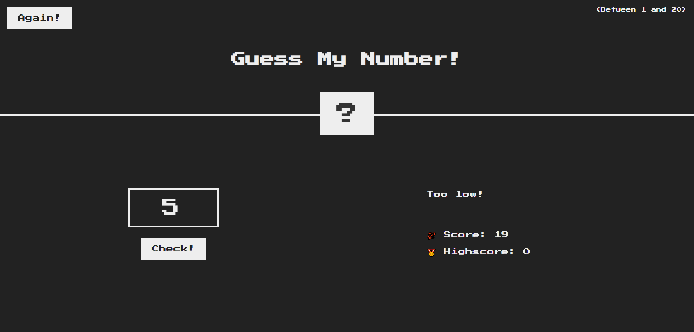

# Guess My Number 🎯 (Vanilla JavaScript)

🔗 **Live Demo:** (https://guess-my-number-js-w-j.netlify.app/)

A fun number guessing game built using **vanilla JavaScript**, where the player guesses a random number between **1 and 20**.  
The game provides instant feedback, score tracking, and a persistent high score.

---

## 🚀 Features

- **Random Number Generation**

  - Generates a random number between 1 and 20 for each game session

- **User Input Validation**

  - Displays a message when no number is entered

- **Game Logic**

  - Compares user guess with the secret number
  - Provides feedback: _Too high_, _Too low_, or _Correct number_

- **Score System**

  - Starts with a score of 20
  - Decreases score with each wrong guess
  - Ends game when score reaches 0

- **High Score Tracking**

  - Stores and updates the highest score achieved during the session

- **Game Reset**

  - Resets score, secret number, and UI styles when clicking **Again**

- **Dynamic UI Updates**
  - Background color change on win
  - Number reveal and animation effects

---

## 🎯 Project Purpose

This project was built to:

- Strengthen core **JavaScript fundamentals**
- Improve performance-focused front-end development skills

---

## 🧠 JavaScript Concepts Used

- DOM manipulation
- Event handling (`click` events)
- Conditional logic (`if / else`)
- Random number generation (`Math.random`)
- Function abstraction for reusable UI updates
- State management with variables

---

## 🛠 Tech Stack

- **HTML5**
- **CSS3**
- **Vanilla JavaScript (ES6)**

---

## 🎯 How to Play

1. Enter a number between **1 and 20**
2. Click the **Check** button
3. Follow the hints to guess the correct number
4. Try to beat your **high score**
5. Click **Again** to restart the game

---

## 📷 Preview

---

## 👨‍💻 Author

**Md. Asaduzzaman Rana**  
Front-End Developer  
Focused on JavaScript fundamentals and interactive UI behavior

---
